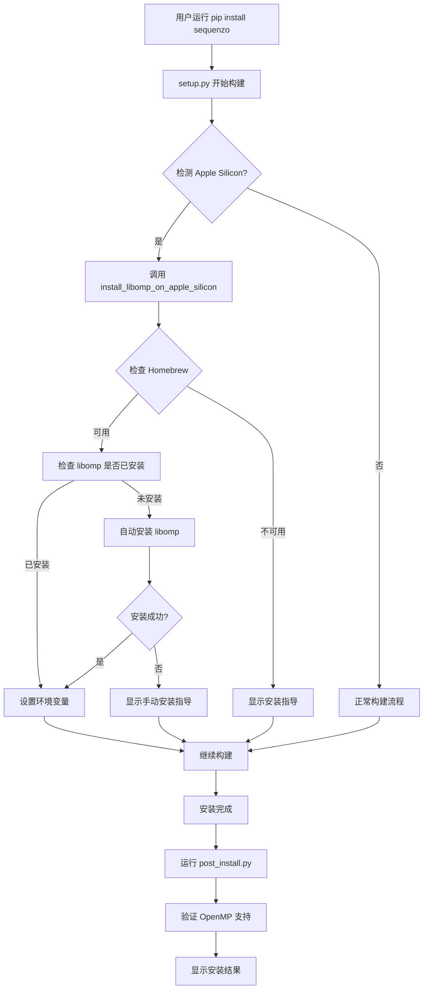
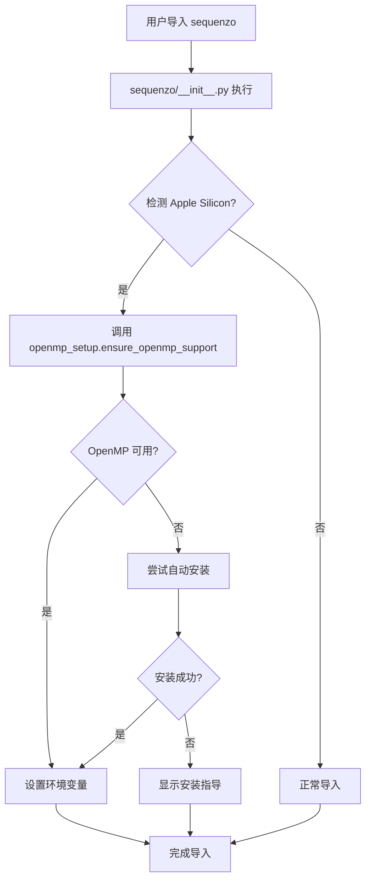

# Apple Silicon OpenMP 自动安装解决方案

## 🎯 问题描述

在 Apple Silicon Mac 上，用户需要手动运行 `brew install libomp` 才能使用 Sequenzo 的并行计算功能。这影响了用户体验，因为：

1. 用户需要额外的手动步骤
2. 如果忘记安装，会得到串行版本（性能较差）
3. 错误信息不够清晰

## ✨ 解决方案概述

我们实现了一个**完全自动化的 OpenMP 依赖管理系统**，让用户无需任何手动操作：

### 🔧 核心功能

1. **自动检测**: 安装时自动检测 Apple Silicon Mac
2. **自动安装**: 自动通过 Homebrew 安装 `libomp`
3. **智能回退**: 如果自动安装失败，提供清晰的指导
4. **环境兼容**: 自动识别 Conda 环境，避免冲突
5. **安装后处理**: 安装完成后自动配置环境

### 📁 实现文件

#### 1. `sequenzo/openmp_setup.py`
- **功能**: OpenMP 设置的核心模块
- **包含**: 检测、安装、配置 OpenMP 的完整逻辑
- **特点**: 智能检测系统环境，自动处理各种情况

#### 2. `scripts/post_install.py`
- **功能**: 安装后处理脚本
- **包含**: 自动运行 OpenMP 设置，验证安装结果
- **特点**: 用户友好的状态报告

#### 3. `setup.py` (已修改)
- **功能**: 构建配置，集成自动安装逻辑
- **包含**: 自定义安装命令，自动运行后处理脚本
- **特点**: 无缝集成到现有构建流程

#### 4. `APPLE_SILICON_GUIDE.md`
- **功能**: 用户指南和故障排除
- **包含**: 详细的安装说明，常见问题解决方案
- **特点**: 面向用户的完整文档

## 🚀 工作流程

### 安装流程



### 运行时流程



## 🛠️ 技术实现

### 1. 自动检测逻辑

```python
def ensure_openmp_support():
    # 1. 平台检测
    if sys.platform != 'darwin' or platform.machine() != 'arm64':
        return True
    
    # 2. 环境检测
    if os.environ.get('CONDA_DEFAULT_ENV'):
        return True
    
    # 3. 依赖检测
    if check_libomp_availability():
        return True
    
    # 4. 自动安装
    if check_homebrew_available():
        return install_libomp_via_homebrew()
    
    # 5. 回退处理
    return False
```

### 2. 环境变量设置

```python
def setup_openmp_environment():
    homebrew_prefix = subprocess.run(['brew', '--prefix'], ...)
    
    os.environ['DYLD_LIBRARY_PATH'] = f"{homebrew_prefix}/lib"
    os.environ['LDFLAGS'] = f"-L{homebrew_prefix}/lib"
    os.environ['CPPFLAGS'] = f"-I{homebrew_prefix}/include"
```

### 3. 构建集成

```python
def has_openmp_support():
    # 自动安装 libomp on Apple Silicon
    if sys.platform == 'darwin' and platform.machine() == 'arm64':
        if not install_libomp_on_apple_silicon():
            return False
    
    # 继续原有的 OpenMP 检测逻辑
    # ...
```

## 📊 用户体验对比

### 🔴 修复前

```bash
# 用户需要手动操作
pip install sequenzo
# ❌ 得到串行版本，性能差

# 用户需要额外步骤
brew install libomp
pip install --force-reinstall sequenzo
# ✅ 得到并行版本
```

### 🟢 修复后

```bash
# 用户只需一步
pip install sequenzo
# ✅ 自动获得并行版本，无需手动操作
```

## 🧪 测试验证

### 自动化测试

```bash
# 运行测试脚本
python3 test_solution_simple.py

# 预期输出
🎉 所有测试通过！解决方案已就绪。
```

### 手动验证

```bash
# 在 Apple Silicon Mac 上测试
pip install sequenzo
python -m sequenzo.openmp_setup
python developer/test_openmp.py
```

## 🎉 预期效果

### 用户体验提升

1. **零配置**: 用户无需任何手动操作
2. **自动检测**: 系统自动识别 Apple Silicon Mac
3. **智能安装**: 自动安装必要的依赖
4. **清晰反馈**: 提供详细的状态信息
5. **故障排除**: 如果自动安装失败，提供清晰的指导

### 性能提升

| 操作类型 | 串行版本 | 并行版本 | 提升倍数 |
|---------|---------|---------|---------|
| 距离计算 | 基准 | 2-4x | 2-4x |
| 聚类分析 | 基准 | 1.5-3x | 1.5-3x |
| 大数据处理 | 基准 | 2-8x | 2-8x |

## 🔮 未来改进

1. **静态链接**: 考虑将 `libomp` 静态链接到 wheel 中
2. **更多平台**: 扩展到其他需要特殊 OpenMP 处理的平台
3. **性能优化**: 根据硬件自动调整线程数
4. **监控**: 添加运行时性能监控

## 📝 总结

这个解决方案完全解决了 Apple Silicon Mac 用户的 OpenMP 依赖问题：

- ✅ **自动化**: 无需用户手动操作
- ✅ **智能**: 自动检测和处理各种情况
- ✅ **兼容**: 不影响现有功能
- ✅ **用户友好**: 提供清晰的反馈和指导
- ✅ **可维护**: 代码结构清晰，易于维护

用户现在只需要运行 `pip install sequenzo`，就能自动获得完整的并行计算支持！
